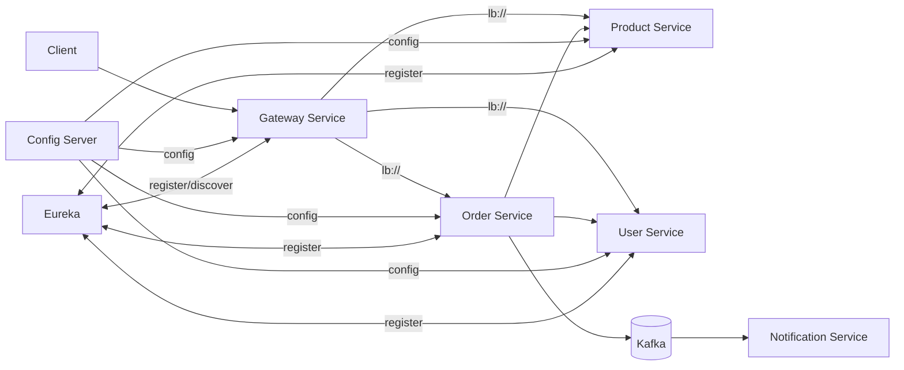

# E-Commerce Microservices (Spring Boot + Spring Cloud)

A Java 21 / Spring Boot 3 microservices demo for a small e-commerce domain (users, products, cart, orders) with service discovery, centralized config, API gateway, async events, and observability.

---

## High-level architecture

- **Config Server** (Spring Cloud Config) — centralized configuration for all services
- **Service Discovery** (Eureka) — service registration + discovery
- **API Gateway** (Spring Cloud Gateway, WebFlux) — single entry point, routing, retries, circuit breaker, (optional) rate limiting
- **Product Service** (Spring MVC + JPA + PostgreSQL) — CRUD + search, stock
- **User Service** (Spring MVC + MongoDB) — user profiles + **Keycloak Admin API** user provisioning
- **Order Service** (Spring MVC + JPA + PostgreSQL) — cart + order creation, calls other services, publishes events
- **Notification Service** (Spring Cloud Stream) — consumes `OrderCreated` events and logs/handles notifications

### Service-to-service interactions

- **Order Service → Product Service**: validate product exists and stock is enough
- **Order Service → User Service**: validate user exists
- **Order Service → Kafka**: publish `OrderCreated` event
- **Notification Service ← Kafka**: consume `OrderCreated` event



---

## Tech stack

**Core**
- Java **21**
- Spring Boot **3.4.x**
- Spring Cloud **2024.0.x**

**Spring Cloud / Patterns**
- Eureka (service discovery)
- Config Server (+ Spring Cloud Bus over RabbitMQ for refresh)
- Spring Cloud Gateway (routing + retry + circuit breaker)
- Resilience4j (retry/circuit breaker)

**Data**
- PostgreSQL (product, order)
- MongoDB (user)

**Async messaging**
- Kafka (OrderCreated event via Spring Cloud Stream)
- RabbitMQ (Spring Cloud Bus for config refresh)

**Security**
- Keycloak (OIDC)
- Gateway as OAuth2 Resource Server (JWT auth)

**Observability**
- Actuator + Prometheus metrics
- Zipkin distributed tracing
- Grafana + Loki (logs) + Prometheus (metrics)

---

## Repository structure

```
.
├─ configserver/        # Spring Cloud Config Server + service configs in src/main/resources/config
├─ eureka/              # Eureka Server
├─ gateway/             # API Gateway (WebFlux)
├─ product/             # Product microservice (PostgreSQL)
├─ user/                # User microservice (MongoDB + Keycloak admin integration)
├─ order/               # Order/Cart microservice (PostgreSQL + service-to-service calls + Kafka event)
├─ notification/        # Event consumer (Kafka)
├─ deploy/docker/       # docker-compose + monitoring/logging configs
└─ additional/          # extra demos/experiments (not required for the core system)
```

---

## Running locally (Docker Compose)

### Prerequisites
- Docker + Docker Compose

### Start everything

From `deploy/docker`:

```bash
cd deploy/docker
# optionally create .env here (see below)
docker compose up -d
```

### Environment variables (recommended)
Create `deploy/docker/.env`:

```bash
DB_USER=embarkx
DB_PASSWORD=embarkx
MONGO_URI=mongodb://mongo:27017
ZIPKIN_URL=http://zipkin:9411/api/v2/spans

RABBITMQ_HOST=rabbitmq
RABBITMQ_PORT=5672
RABBITMQ_USERNAME=guest
RABBITMQ_PASSWORD=guest
RABBITMQ_VHOST=/
```

### Useful UIs / ports
- Gateway: `http://localhost:8080`
- Eureka: `http://localhost:8761`
- Config Server: `http://localhost:8888`
- Keycloak: `http://localhost:8443` (admin/admin)
- Zipkin: `http://localhost:9411`
- Prometheus: `http://localhost:9090`
- Grafana: `http://localhost:3000` (anonymous enabled in compose)
- RabbitMQ UI: `http://localhost:15672` (guest/guest)
- PgAdmin: `http://localhost:5050`

> Note: in the provided compose file, internal service ports (8081/8082/8083/8084) are not exposed to host by default — the intended entry is **Gateway**.

---

## API overview

### Product Service
- `POST /api/products` — create product
- `GET /api/products` — list products
- `GET /api/products/{id}` — get product
- `PUT /api/products/{id}` — update
- `DELETE /api/products/{id}` — delete
- `GET /api/products/search?keyword=...` — search

### User Service
- `POST /api/users` — create user (also creates a Keycloak user)
- `GET /api/users` — list users
- `GET /api/users/{id}` — get user
- `PUT /api/users/{id}` — update user

### Cart + Orders (Order Service)
- `POST /api/cart` — add to cart (requires header `X-User-ID`)
- `GET /api/cart` — get cart (requires header `X-User-ID`)
- `DELETE /api/cart/items/{productId}` — remove from cart (requires header `X-User-ID`)
- `POST /api/orders` — create order from cart (requires header `X-User-ID`)

### Example cURL

```bash
# create product (via gateway)
curl -X POST http://localhost:8080/api/products \
  -H "Content-Type: application/json" \
  -d '{"name":"Keyboard","description":"Mechanical","price":99.99,"stockQuantity":10,"category":"Accessories","imageUrl":""}'

# add to cart
curl -X POST http://localhost:8080/api/cart \
  -H "Content-Type: application/json" \
  -H "X-User-ID: <userId>" \
  -d '{"productId":"1","quantity":1}'

# create order
curl -X POST http://localhost:8080/api/orders \
  -H "X-User-ID: <userId>"
```

---

## Observability

- Each service exposes Spring Boot **Actuator** endpoints.
- Traces are exported to **Zipkin**.
- Metrics are scraped by **Prometheus**.
- Logs are shipped to **Loki** and explored in **Grafana**.

---
